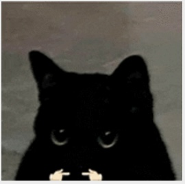

<h2>Hey, I'm eggoil</h2>



<p>
  <em>
    CS/Math student @ University of Maryland<br>
    Research Associate @ NIST<br>
    SWE Intern @ OKC Thunder
  </em>
</p>

<a href="https://linkedin.com/in/daniel-s-yi">
  
</a>
<a href="https://discord.com/users/721013955811606621">
  
</a>

<h3>A little bit about me...</h3>

```rust
fn main() {
    let eggoil166 = User {
        name: String::from("Daniel Yi"),
        email: String::from("e.g.g.wp16@gmail.com"),
        interests: vec![
            "ML systems",
            "simulation",
            "computer vision",
            "developer tools",
            "low-level dev",
        ],
        languages: vec![Python, Java, Rust, C++, JS/TS, SQL],
        frameworks: vec![
            PyTorch,
            TensorFlow,
            JAX,
            scikit_learn,
            Flask,
            Django,
            React,
            Node_js,
            WebSockets,
        ],
        tools: vec![Git, Docker, AWS, Jupyter, Supabase, Linux, PowerShell, Blender, Nix],
    };
}
```

<em>Definitely reach out! I'm always happy to talk about projects, research, startups, quant, or anything technical.</em>

---

<h2>Current / recent projects</h2>

<table>
  <tr>
    <td width="50%">
      <h4><a href="https://github.com/eggoil166/ttr">ttr</a></h4>
      <h6>Stack: Python, Textual, search algorithms, replay parsing, simulation</h6>
      <p>
        TETR.IO replay inspector and 40-line sprint agent. Parses <code>.ttr</code> replay files, reconstructs game state, validates timing/physics against real sprint replays, and runs A*/beam-search placement agents. Includes CLI verification tools, frame-by-frame playback, and a terminal UI for visualizing board state and agent decisions.
      </p>
    </td>
    <td width="50%">
      <h4><a href="https://github.com/eggoil166/clipboard">Clipboard</a></h4>
      <h6>Stack: Rust, SQLite, WinAPI</h6>
      <p>
        Open-source clipboard manager experiment focused on local history, GUI workflows, and safer copy/paste behavior. Current roadmap includes encrypted local clips, source-based copy rules, one-time paste detection, binary visualization, and possible TUI / floating-widget interfaces.
      </p>
    </td>
  </tr>
  <tr>
    <td width="50%">
      <h4><a href="https://github.com/eggoil166/predmark">predmark</a></h4>
      <h6>Stack: Rust, TypeScript, generated client bindings</h6>
      <p>
        Prediction-market prototype with a Rust backend and TypeScript bindings for users, balances, markets, positions, trades, price history, and market-resolution flows. Built for the purposes of web-based deployment for hackathon organizers but... failed to launch :(
      </p>
    </td>
  </tr>
</table>

---

<h2>Featured shipped projects</h2>

<table>
  <tr>
    <td width="50%">
      <h4><a href="https://github.com/eggoil166/Daily-Indigest">Daily Indigest</a></h4>
      <h6>Stack: Python, Flask, React, TypeScript, Google Gemini, Rust, SpacetimeDB</h6>
      <h6>2nd Best Data-Driven Hack @ HopHacks 2025, sponsored by Marshall Wace</h6>
      <p>
        Real-time tweet geo-visualization platform that maps location-tagged posts, clusters emerging topics, and uses Gemini to explain trends. I worked across the backend, real-time data layer, and AI trend explanation pipeline.
      </p>
    </td>
    <td width="50%">
      <h4><a href="https://bearly-running.vercel.app">Bear Escape</a></h4>
      <h6>Stack: React, TypeScript, Node.js, Socket.IO, Gemini, OpenCV, MediaPipe</h6>
      <h6>Best UI/UX and Best Use of Gemini API @ BigRed//Hacks 2025</h6>
      <p>
        Web rhythm game where players keep a bear running by matching notes to the beat. Includes AI-generated charts from uploaded music, multiplayer support, and computer-vision controls using gesture detection.
      </p>
    </td>
  </tr>
  <tr>
    <td width="50%">
      <h4><a href="https://github.com/eggoil166/friesinthebag">Fries in the Bag</a></h4>
      <h6>Stack: Python, Flask, NumPy/SciPy, React, TypeScript, FFT/signal processing</h6>
      <h6>Best Digital Forensics @ HoyaHacks 2026</h6>
      <p>
        Audio steganography and forensics tool that hides binary data inside WAV files using high-frequency signal encoding. Uses FFT and bandpass filtering for encode/decode, with a web interface for generating, visualizing, and recovering hidden messages.
      </p>
    </td>
    <td width="50%">
      <h4><a href="https://github.com/eggoil166/aegis">Aegis</a></h4>
      <h6>Stack: Python, Flask, Next.js, TypeScript, Gemini API, Ollama</h6>
      <p>
        Multi-layer AI jailbreak and prompt-injection detection system. Combines pattern matching, ML-style classification, and LLM-powered analysis to detect risky prompts, score threat levels, and rewrite unsafe inputs through a dashboard/playground interface.
      </p>
    </td>
  </tr>
</table>

---

<h2>Older / experimental work</h2>

<table>
  <tr>
    <td width="50%">
      <h4><a href="https://github.com/eggoil166/mall">Mall</a> + <a href="https://github.com/eggoil166/multiview">Multiview</a></h4>
      <h6>Stack: Python, OpenCV, PyTorch, scikit-learn, DeepSORT, Jupyter</h6>
      <p>
        Computer-vision experiments for footfall detection and motion tracking across single-view and multi-view camera setups. Explores detection collation over multiple frames and camera perspectives.
      </p>
    </td>
    <td width="50%">
      <h4><a href="https://github.com/darthmaulsw/VibeCADing">Suzanne / VibeCADing</a></h4>
      <h6>Stack: Python, Flask, TypeScript, React, Gemini, Node.js, Supabase, ElevenLabs</h6>
      <p>
        Voice-driven 3D CAD generation experiment. Users describe objects with voice input, the system generates OpenSCAD code, converts it to 3D assets, and previews models in-browser with support for image-to-CAD and AR-style viewing.
      </p>
    </td>
  </tr>
</table>

---

<div align="center">
  
  
  
</div>

<div>
  
</div>

<div align="center">
  
</div>
